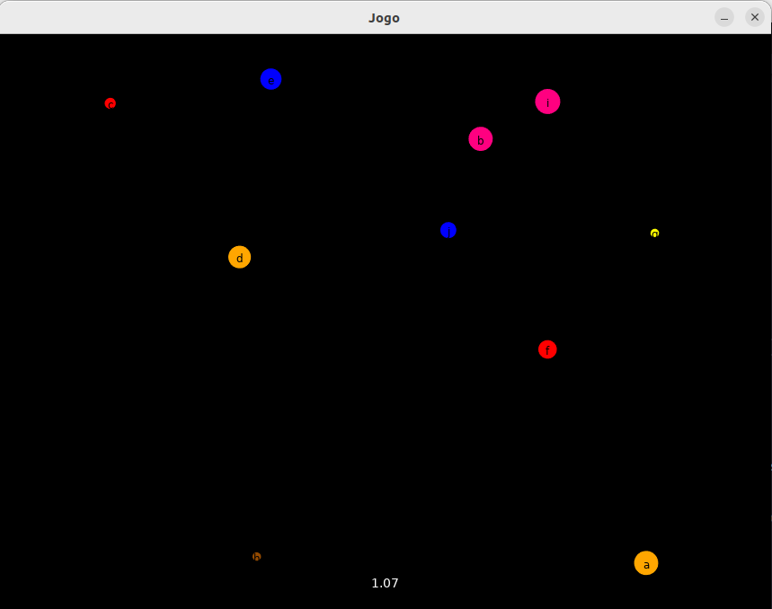
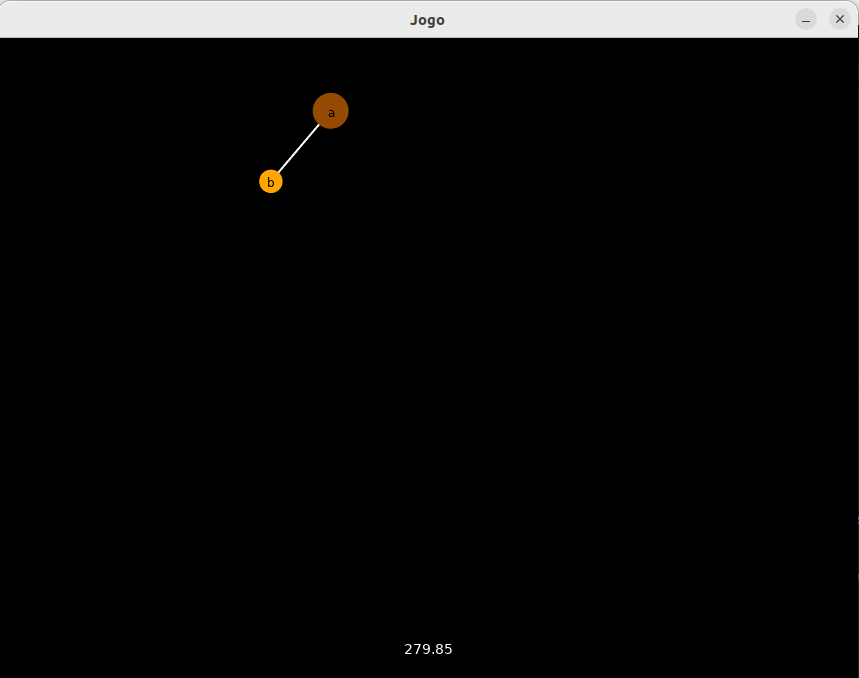
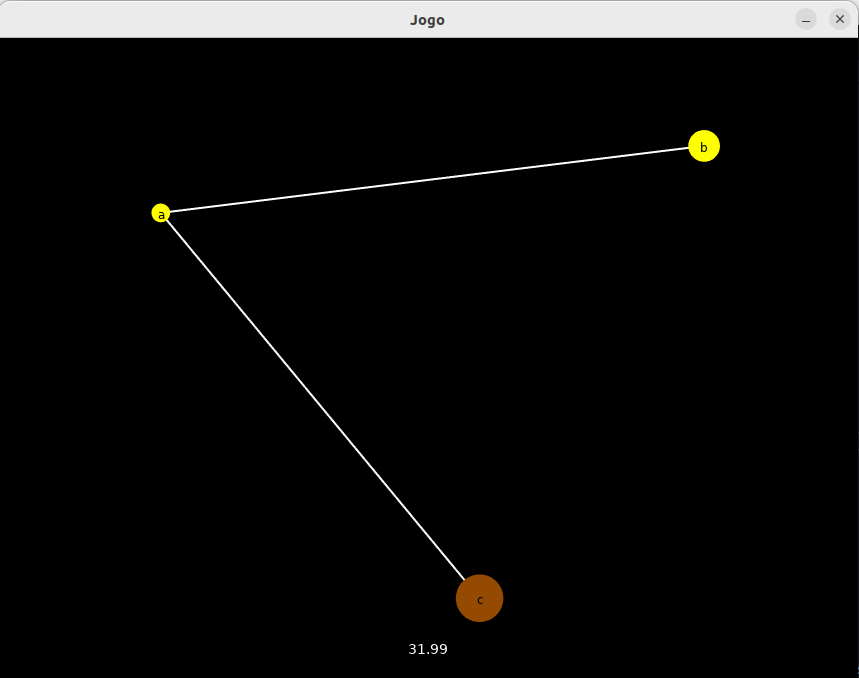

# About
 This is a planetary simulator using graphs developed for a college project. The C language and the Allegro library were used for this project.

# Running
### Download Allegro
[Link](https://github.com/liballeg/allegro_wiki/wiki/Quickstart)
### Run
`gcc -Wall -o main main.c tela.c grafo.c -lallegro_font -lallegro_color -lallegro_ttf -lallegro_primitives -lallegro -lm`
# Images

